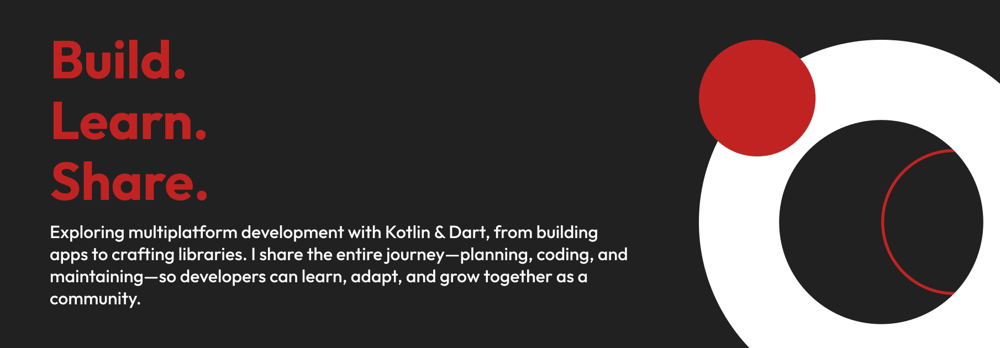

# Hi, I’m Dwiki (Wiki) 👋

**Software Engineer (Mobile) — Kotlin & Dart • Multiplatform • Developer Experience**

Curious by nature, practical by choice. I love building simple, reliable software that scales across platforms.

> “Code is a tool. What matters is the experience we create for both developers and users.”

### Get in touch
 
 
 
 
 

---

## 🔭 What I’m working on
- 🎥 Preparing a YouTube series that walks through the full engineering loop: plan → code → ship → maintain. I’ll share architecture decisions, trade‑offs, and how I keep things simple without losing depth.
- ✍️ Writing on [Medium](https://medium.com/@wikinotes) and [Dev.to](https://dev.to/dwkryd) — a mix of free and member‑only posts on Developer Experience, KMP, testing, and productivity.
- 🧩 Building apps & libraries — e.g., a presence/attendance app using a local database, plus small utilities to improve DX and automation.
- 🧪 Kotlin Multiplatform experiments: sharing core logic across Android/iOS/desktop while keeping native UX.

---

## 🧰 Tech stack

- Focus: Kotlin, Dart, Flutter, KMP
- Interests: Developer Experience (DX), tooling, automation, performance, testing

---

## 🎮 Beyond the code
- Solo gaming — story‑driven adventures and strategy
- Reading — psychology, history, mindset, and manga
- I care about simplicity and depth; I ship pragmatic solutions without losing quality

---

[**Explore my projects**](https://github.com/dwikiriyadi?tab=repositories) • [**Join the conversation**](https://discord.gg/2cs7Hn9Uht)

## 📊 GitHub Stats

